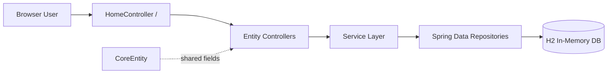

# Asset Management Service

[](https://www.oracle.com/java/)
[](https://spring.io/projects/spring-boot)
[](https://maven.apache.org/)
[](LICENSE)

Asset Management Service is a Spring Boot application for managing asset inventories across financial, tangible, and intangible domains with a server-rendered MVC experience.

## Product Overview

The platform organizes assets into three business-facing categories:

- **Financial Assets**: bank accounts, stocks, and bonds
- **Tangible Assets**: cash, inventory, machinery, real estate, and vehicles
- **Intangible Assets**: brands, patents, trademarks, copyrights, and reputation

Current implementation includes CRUD web flows for these entities with Thymeleaf views, Spring Data JPA persistence, and H2 in-memory storage for local development.

## Tech Stack

- **Spring Boot 4.0.5**
- **Java 25**
- **Spring MVC + Thymeleaf** for web UI
- **Spring Data JPA + H2** for persistence
- **Maven Wrapper** for build/test/run

## Architecture (Compact)



### Implemented MVC Pattern

`controller -> service -> repository -> JPA/H2`

Reference slice:
- `src/main/java/com/sdr/ams/controller/BankAccountController.java`
- `src/main/java/com/sdr/ams/service/BankAccountService.java`
- `src/main/java/com/sdr/ams/repository/BankAccountRepository.java`
- `src/main/resources/templates/bank-accounts/`

## Current Application Surface

- Home page: `GET /`
- Asset list pages linked from home (`/bank-accounts`, `/bonds`, `/stocks`, `/cash`, `/inventories`, `/machineries`, `/real-estates`, `/vehicles`, `/brands`, `/copyrights`, `/patents`, `/reputations`, `/trademarks`)
- Per-entity CRUD pages with dedicated `list.html` and `form.html` templates

## Planned Upload API (Example Contract)

> Status: **Planned / not currently implemented in controllers**. The example below is a proposed contract for external integrations.

### Request

```http
POST /api/uploads HTTP/1.1
Content-Type: multipart/form-data; boundary=----AssetBoundary

------AssetBoundary
Content-Disposition: form-data; name="assetType"

financial
------AssetBoundary
Content-Disposition: form-data; name="file"; filename="bank-accounts.csv"
Content-Type: text/csv

id,name,createdBy,updatedBy
,Operating Account,system,system
------AssetBoundary--
```

### Response (Example)

```json
{
  "uploadId": "up_20260329_001",
  "status": "accepted",
  "assetType": "financial",
  "receivedRecords": 1,
  "message": "File received and queued for processing"
}
```

## Build and Run

Prerequisites:
- Java installed (project targets **Java 25**)
- `JAVA_HOME` configured

Commands (Windows PowerShell):

```powershell
./mvnw.cmd test
./mvnw.cmd spring-boot:run
./mvnw.cmd package
```

Useful local endpoints after startup:
- App: `http://localhost:8080/`
- H2 Console: `http://localhost:8080/h2-console`

## Repository Notes

- Shared base entity: `src/main/java/com/sdr/ams/model/core/CoreEntity.java`
- Runtime config: `src/main/resources/application.yaml`
- Baseline tests: `src/test/java/com/sdr/ams/AssetManagementServiceApplicationTests.java`, `src/test/java/com/sdr/ams/HomeControllerWebMvcTest.java`

