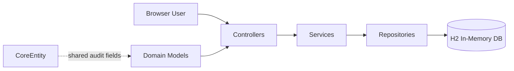

# Asset Management Service

[](https://www.oracle.com/java/)
[](https://spring.io/projects/spring-boot)
[](https://maven.apache.org/)
[](LICENSE)

## Product Overview

Asset Management Service is a Spring Boot MVC application for managing enterprise assets across financial, tangible, and intangible domains.

It provides a unified, server-rendered user experience for CRUD operations, validation, and audit-friendly metadata so teams can maintain structured records through one application.

## What’s Implemented Now

- Asset categories and modules:
  - **Financial**: bank accounts, bonds, stocks
  - **Tangible**: cash, inventories, machineries, real estates, vehicles
  - **Intangible**: brands, copyrights, patents, reputations, trademarks
- CRUD web pages across all listed modules
- Shared base entity with audit fields via `CoreEntity`
- H2 in-memory persistence with schema auto-update for local development
- Mixed architecture patterns:
  - generic CRUD pattern for simpler entities
  - rich domain pattern (search + normalization + business validation) for entities like bank accounts, real estates, vehicles, trademarks, stocks, and reputations

## Tech Stack

- **Java 25**
- **Spring Boot 4.0.5**
- **Spring MVC + Thymeleaf**
- **Spring Data JPA**
- **H2 Database (in-memory)**
- **Maven Wrapper**
- **jakarta.validation-api**

## Architecture



High-level flow: `controller -> service -> repository -> JPA/H2`

Reference implementation slice:
- `src/main/java/com/sdr/ams/controller/BankAccountController.java`
- `src/main/java/com/sdr/ams/service/BankAccountService.java`
- `src/main/java/com/sdr/ams/repository/BankAccountRepository.java`
- `src/main/resources/templates/bank-accounts/`

## Application Surface / Routes

| Area | Routes |
|---|---|
| Home | `/` |
| Financial | `/bank-accounts`, `/bonds`, `/stocks` |
| Tangible | `/cash`, `/inventories`, `/machineries`, `/real-estates`, `/vehicles` |
| Intangible | `/brands`, `/copyrights`, `/patents`, `/reputations`, `/trademarks` |

All routes above are linked from `src/main/resources/templates/index.html`.

## Quick Start (PowerShell commands)

### Prerequisites

- JDK **25** installed
- `JAVA_HOME` configured to JDK 25

### Commands

```powershell
./mvnw.cmd test
./mvnw.cmd spring-boot:run
./mvnw.cmd package
```

### Troubleshooting (evidenced)

- If Maven wrapper reports `JAVA_HOME environment variable is not defined correctly`, update `JAVA_HOME` to your JDK 25 installation.

## Local Endpoints

- App: `http://localhost:8080/`
- H2 Console: `http://localhost:8080/h2-console`

## Project Structure

| Path | Purpose |
|---|---|
| `src/main/java/com/sdr/ams/controller` | MVC controllers and route handling |
| `src/main/java/com/sdr/ams/service` | business rules, normalization, orchestration |
| `src/main/java/com/sdr/ams/repository` | Spring Data repositories |
| `src/main/java/com/sdr/ams/model` | domain entities (`core`, `financial`, `tangible`, `intangible`) |
| `src/main/resources/templates` | Thymeleaf pages by module |
| `src/main/resources/application.yaml` | runtime and persistence configuration |
| `docs` | domain specifications used for rich entity behavior |

Where to add a new entity/module:
1. Add entity class under `src/main/java/com/sdr/ams/model/...`
2. Add repository in `src/main/java/com/sdr/ams/repository`
3. Add service in `src/main/java/com/sdr/ams/service`
4. Add controller in `src/main/java/com/sdr/ams/controller`
5. Add templates in `src/main/resources/templates/{module}/`
6. Add module link in `src/main/resources/templates/index.html`

## Planned Capabilities

> **Planned**: upload API contract for external integrations (not implemented in current controllers).

### Planned Example Contract

#### Request

```http
POST /api/uploads HTTP/1.1
Content-Type: multipart/form-data; boundary=----AssetBoundary

------AssetBoundary
Content-Disposition: form-data; name="assetType"

financial
------AssetBoundary
Content-Disposition: form-data; name="file"; filename="bank-accounts.csv"
Content-Type: text/csv

id,name,createdBy,updatedBy
,Operating Account,system,system
------AssetBoundary--
```

#### Response (Example)

```json
{
  "uploadId": "up_20260329_001",
  "status": "accepted",
  "assetType": "financial",
  "receivedRecords": 1,
  "message": "File received and queued for processing"
}
```

## Release Notes (0.0.1-SNAPSHOT)

### Added

- End-to-end CRUD flows for 13 asset modules with server-rendered pages
- Shared audited base model through `CoreEntity`
- Rich domain implementations with filtering, normalization, and validation for selected modules

### Changed

- Project documentation updated for product, architecture, onboarding, and release communication
- Template structure standardized to per-module folders for customization

### Fixed

- File upload fields were removed from real-estate model/UI; active flows no longer rely on upload handling

### Known Issues

- `RealEstateController#delete` currently redirects to `/bank-accounts` instead of `/real-estates`
- Test suite in local shells requires correct `JAVA_HOME` (JDK 25)

## Contributing

Contributions are welcome. Keep changes aligned with domain specs in `docs/*.md`, follow existing controller/service/repository patterns, and run tests before submitting changes.

## License

This project is licensed under the MIT License. See `LICENSE` for details.

